### Data Source

In this project, we will be analyzing the storms in the North Atlantic Basin from the years 1980-2010. The data source will be from the IBTrACS dataset found in the following site:

"https://www.ncdc.noaa.gov/ibtracs/index.php?name=wmo-data"

From here, we will navigate down to the table under "Access", look at the Data Access File "Storms by Basin" under the Hurdat format, and click on "Basin.NA.ibtracs_hurdat.v03r06.hdat". The data source should be found under the link below:

"ftp://eclipse.ncdc.noaa.gov/pub/ibtracs/v03r06/wmo/hurdat_format/basin/Basin.NA.ibtracs_hurdat.v03r06.hdat"


### Cleaning and Data Analysis

To analyze the data, we need to do some cleaning and processing of the raw 
data. To work with the data, we need to use the packages below
```{r, echo=FALSE}
library(readr)
library(stringr)
```

Here are the cleaned csv files
```{r, echo=FALSE}
storm <- read.csv(file = "../data/storm.csv", stringsAsFactors = FALSE)
tracks <- read.csv(file = "../data/tracks.csv", stringsAsFactors = FALSE)
```

### Storm Analysis per Year

Storms per year: we can see that the storm frequency fluctuates between about 
10-12 storms per year, with an outlier in 2005 due to Hurricane Katrina
```{r, echo = FALSE}
# Storms per year
load("../images/table_stormsperyear.rda")
print(table_stormsperyear)
```

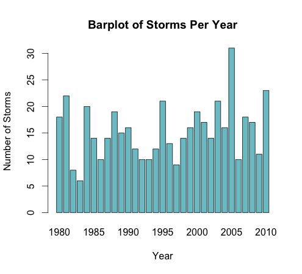

Storms with winds >= 35: we can see that the storms with winds >= 35 fluctuate 
between approximately 5 storms. The storms are in closer range; from this we 
can deduce that this is because weaker storms are more common.
```{r, echo = FALSE}
# Storms with winds >= 35 knots
load('../images/table_winds35yr.rda')
print(table_winds35yr)
```

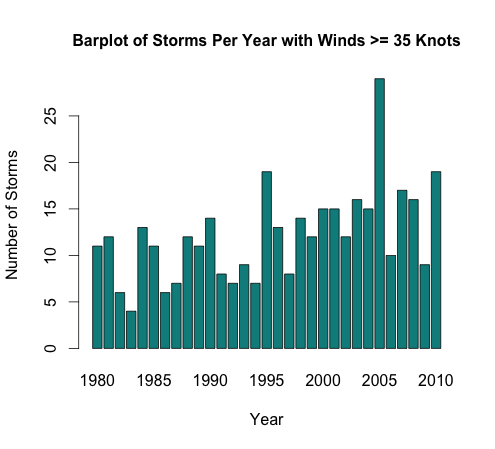

Storms with winds >= 64: we can see that the storms with winds >= 64 peaked 
approximately every 5 years.
```{r, echo = FALSE}
# Storms with winds >= 64 knots
load('../images/table_winds64yr.rda')
print(table_winds64yr)
```

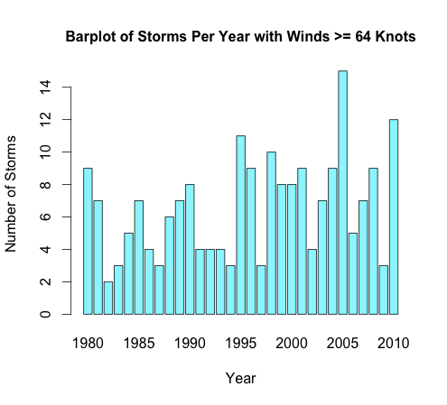

Storms with winds >= 96: we can see that there aren't very many storms with 
winds >= 96. Looking at each decade, we can see that the hurricane trajectories 
increased every decade.
```{r, echo = FALSE}
# Storms with winds >= 96 knots
load('../images/table_winds96yr.rda')
print(table_winds96yr)
```

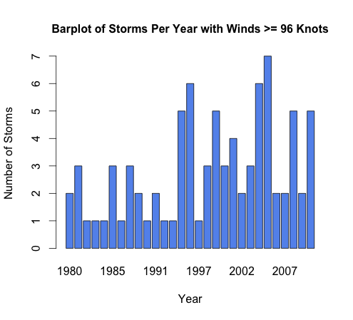

### Storm Analysis Per Month

Storms per month: we can see that there are the most storms in the middle 
of the year, particularly in August and September. 
```{r, echo = FALSE}
# Storms per month
load('../images/table_stormspermonth.rda')
print(table_stormspermonth)
```

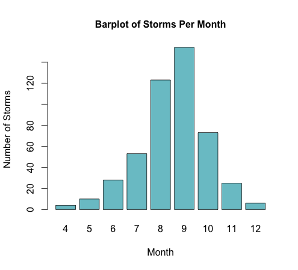

Storms with winds >= 35: we can see that the storms with winds >= 35 peak 
in August and September. The difference from July to August and September 
to October is by about 70 storms 
```{r, echo = FALSE}
# Storms with winds >= 35 knots
load('../images/table_winds35mth.rda')
print(table_winds35mth)
```

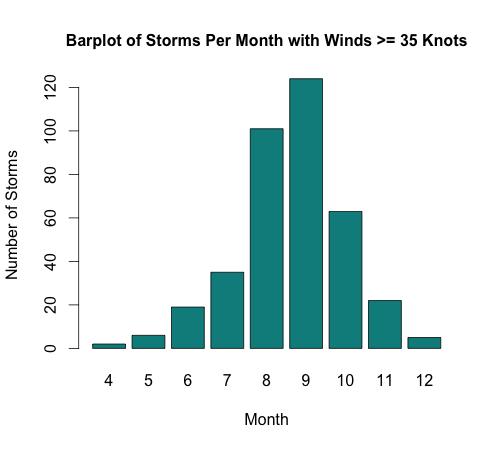

Storms with winds >= 64: we can see that the storms with winds >= 64 also 
peak in August and September, but the storm difference from July to August 
and September to October decreased to approximately 40 storms. This pattern 
makes sense because it is less likely to have more stronger storms than weaker storms
```{r, echo = FALSE}
# Storms with winds >= 64 knots
load('../images/table_winds64mth.rda')
print(table_winds64mth)
```

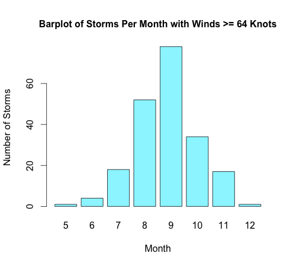

Storms with winds >= 96: we can see that the storms with winds >= 96 are 
significantly less frequency than storms per month by speeds 35 or 64. As 
observed from the chart, strong storms do not occur very often, but when 
they do, it peaks in August and September. The difference from July to 
August and September to October is about 30 storms.  
```{r, echo = FALSE}
# Storms with winds >= 96 knots
load('../images/table_winds96mth.rda')
print(table_winds96mth)
```

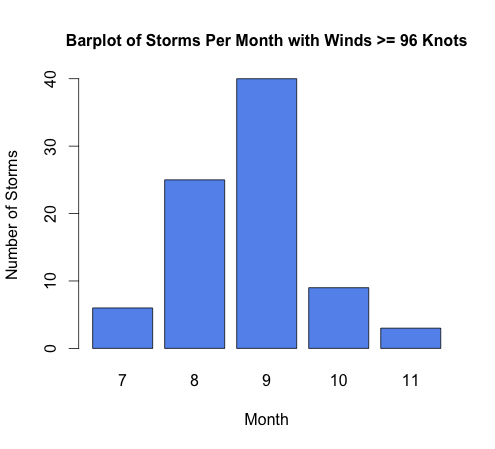

Average storms by wind speed:
```{r, echo = FALSE}
# Average Storms by Wind Speed
load('../images/table_avgstorms.rda')
print(table_avgstorms)
```


### Regression Analysis

Regression Analysis: We can see that the mean and median wind speeds and 
pressures has a linear correlation
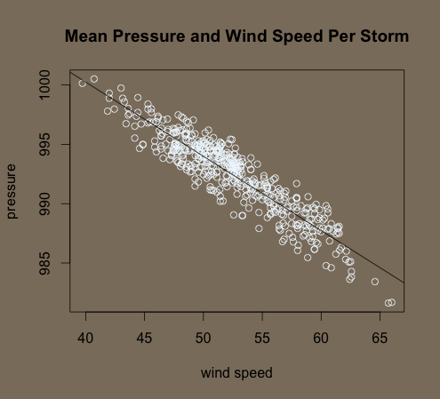

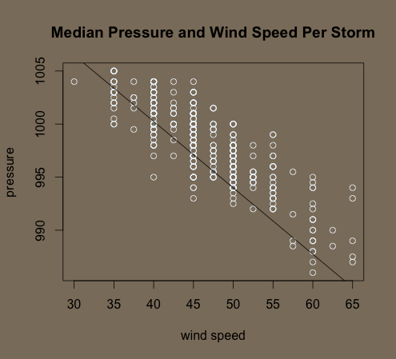


### World Map Analysis

Map Analysis by Year: here we can see several storms occured in the North 
Atlantic and East Pacfic Basins, with more concentrated winds in the East
Pacific Basin and more interspersed winds in the North Atlantic
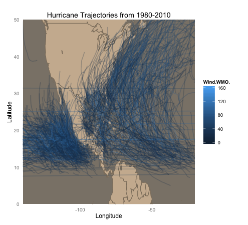

Map Analysis by Month: here we can see that the wind trajectories occur 
more frequently from July to October. We can thus conclude that hurricane
season occurs during those months
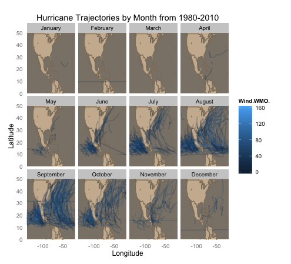

Map Analysis in the 1980s: here we can see that not very many hurricanes
occurred during this decade. The wind trajectories are spread out, with
no year that is particularly prominent
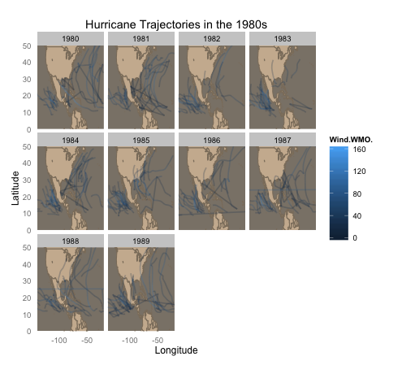

Map Analysis in the 1990s: from 1990-1993 there are more concentrated 
storms that occur in the East Pacific Basin, whereas in 1994-1999, there
are more storms in the North Atlantic Basin
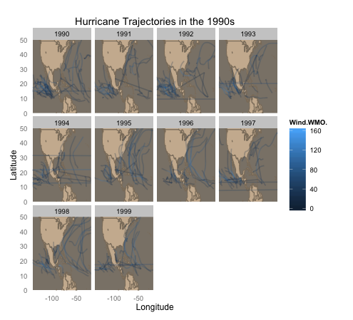

Map Analysis in the 2000s: the storms seem to occur more on the North 
Atlantic, with heavier storms in 2005, when Hurricane Katrina occured.
The hurricane trajectories throughout the rest of the decade is 
consistent otherwise.
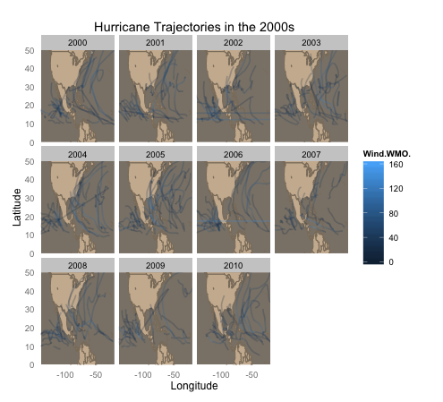


